# 同济大学嘉定校区"9·26"学生坠亡事件 梳理报告

> 整理日期：2026年9月30日（10月4日补充更新）
> 信息来源：工作目录内 35 张截图（微信群聊记录 24 张、小红书帖文 2 张、校园社区帖文 8 张、网传文字及 AI 生成内容截图 1 张）
> 性质声明：本报告仅为对既有网络流传材料的客观整理，**所有信息未经官方证实**，不构成对任何个人或单位的事实认定或指控。事件真相以公安机关调查结论和学校官方通报为准。

声明：

> 如果你是学校舆情部门相关人员，希望删除此仓库，请在 issues 中留言，git 提交者将会配合删除此仓库。本仓库仅用于对已在网络空间公开流传的信息作个人归档与客观整理，供留存、自查与后续更正之用；**不作事实定性、不作责任归因，不针对任何个人或单位作出评价、指控或传播**，相关内容以公安机关调查结论与学校官方通报为准。本仓库不用于扩散信息，无意引起舆情。

> 如果你了解更多真相，希望补充信息，请提交 PR 或在 issues 中说明。提交者同样欢迎纠错：若内容存在失实、或与官方结论不符，将在收到说明后配合更正。

---

## 一、事件概述

2026年9月26日，同济大学嘉定校区朋园6号楼（研究生宿舍楼，俗称"朋6"）发生一起学生坠楼事件。坠亡者为该校汽车学院能源动力专业 2025 级硕士研究生杨紫依（女，23 岁，江西吉安人）。

据同学间聊天记录转述，坠亡者于当日早上 8 点多被发现（家属帖文称事发于 26 日凌晨）；坠落后位于 2 楼平台处，17 层电梯旁窗台上遗留有其手机、校园卡及拖鞋。当日警方到场处置。9 月 29 日至 30 日前后，自称为死者家属的用户在小红书发布帖文，对培养过程管理提出多项质疑并请求学校正面答复。截至本报告整理时（9 月 30 日），**未见校方或警方官方通报**。

## 二、当事人基本情况

以下信息来自家属帖文及帖文照片中的证件，未经独立核实：

| 项目 | 内容 |
|---|---|
| 姓名 | 杨紫依 |
| 性别 | 女 |
| 年龄 | 23 岁 |
| 籍贯 | 江西吉安 |
| 身份 | 同济大学（嘉定校区）汽车学院能源动力专业硕士研究生，2025 年 9 月入学 |
| 其他 | 家属称其本科、研究生期间为学生骨干、党员、曾任班长，"品学兼优、阳光开朗" |

## 三、时间线（依据聊天记录截图整理，均为转述）

| 时间 | 事件 | 来源 |
|---|---|---|
| 9月25日晚 | 室友转述：死者当晚还与另一室友聊天很久，"以为好了"；已购买 26 日返家车票，其父原定到高铁站接站 | 同学群聊（***转述） |
| 9月26日 07:44–07:45 | 楼栋值班员在"朋6女生硕士25级群"发布失物招领：17 层电梯旁窗台有手机、校园卡、拖鞋（附照片） | 群聊截图 |
| 9月26日 早上8点多 | 坠亡被发现。群聊称"宿管刚找到"（08:45 前后）；目击同学称尸体在 2 楼平台处 | 同学群聊 |
| 9月26日 09:04 | 有同学看到楼下警车、救护车到场 | 同学群聊 |
| 9月26日 09:28 | 有同学称"现在把校园网和我们门禁全断了"（转述，未证实） | 同学群聊 |
| 9月26日 09:57–10:59 | 多名同学目击现场有三四名警察、一名持相机人员（有"不会是法医吧"的猜测） | 同学群聊 |
| 9月26日 10:38–11:59 | 事件在多个学生群传播；室友称另一名室友十点多回电时"在警察局"；宿舍群阿姨发布认领通知 | 同学群聊 |
| 9月26日 13:19 起 | 多个群聊转发事件消息，出现"钢筋水泥板都裂了"等现场说法（未证实） | 同学群聊 |
| 9月26日 下午 | 群聊中出现对导师的指责性言论（详见第五节） | 同学群聊 |
| 9月29–30日前后 | 自称家属的小红书用户"杨家菇凉"发布帖文及逝者证件照片，提出质疑与诉求 | 小红书截图 |
| 10月3日 | 自称逝者高中同学的账号在校园社区发帖悼念、澄清并求助；据其单方转述，家属与学院方面的谈判已进行至第五次 | 校园社区帖文 |
| 10月3–4日 | 上述同学持续更新：称家属已寻求律师介入、多平台帖文被下架、已对逝者设备信息存证 | 校园社区帖文 |

> 注：家属帖称事发于"26 日凌晨"，同学聊天多称"早上 8 点多被发现"，两者不矛盾（凌晨坠落后至早上才被发现），但确切时间未经证实。

## 四、家属方面的说法与诉求（小红书帖文，自称死者姑姑）

1. 称杨紫依于 2026 年 9 月 26 日凌晨在嘉定朋6坠亡，年仅 23 岁；
2. 称其"从小在家人、老师、同学眼里品学兼优、阳光开朗"，本科、研究生期间均为学生骨干、党员班长；
3. 质疑点（家属单方说法，未经证实）：
   - 为何"在团圆佳节（中秋刚过）走上不归路"；
   - 称其在"17 楼狭窄楼道窗户"坠楼，追问"怎样的管理缺失"；
   - 称大导（博导，帖中用"代名"：杨带君）、小导（帖中用"代名"：洪泼）"至今拒绝出面"，并称死者曾向大导寻求帮助"遭拒绝"；
4. 诉求：恳请学校给出正面答复，"还家属一个公道、一个真相"。

## 五、同学群聊中的说法（转述，情绪化言论较多，均未证实）

1. **学业压力**：有同学称死者"明明九月初都还好好的，就因为开题这个事情"；多人提到"开题就被逼的跳楼""导师压榨"等说法。
2. **导师信息**：群聊中有人提及大导、小导姓名（用字与家属帖的"代名"不一致，可能为同音转写）。个别学生有"她小导和大导就是杀人凶手"等激烈言论——**此为个别学生在情绪激动下的主观指责，无任何证据支持，不应作为事实传播**。
3. **生前状态**：室友转述其前晚仍正常聊天、已购票回家；一室友得知消息后情绪崩溃（"呼吸碱中毒""不敢回去"）；有同学称死者是班长，同班男生起初并不知跳楼者身份。
4. **现场信息**：警车、救护车到场；有拍照取证人员；"校园网和门禁全断"（转述）；"钢筋水泥板都裂了"（转述，未证实）。
5. **其他**：群聊中一度误传跳楼者为"班上的男生打听班长是谁"，后确认即班长本人。

## 六、存疑与待核实事项

1. **确切坠亡时间**：凌晨（家属说法）与早上 8 点多被发现（同学说法）之间的关系；
2. **坠落起点**：家属称 17 楼楼道窗户；群聊中有"11 楼跳到 2 楼平台"一句，与 17 楼说法存在数字出入，可能为转述笔误；
3. **"钢筋水泥板都裂了"**：仅为群聊转述，无影像佐证；
4. **导师责任相关指控**：家属与部分学生的说法均为单方陈述，涉事导师姓名在传播中以"代名"或同音字出现，真实性待查；
5. **校方回应情况**：截至 9 月 30 日，材料中未出现校方通报或警方结论；
6. **是否出现于官方渠道**：材料中未见任何官方文件。

原始未脱敏截图保留于本地但不纳入版本库（见 `.gitignore`）。

## 七、整理原则

- 区分**事实记录**与**传言转述**，所有二手信息均已标注来源属性；
- 保留群聊原话中可佐证情绪与氛围的内容，但不复述、不放大其中的侮辱性、指控性表述；
- 不做归因推断，不下结论；一切以官方调查结论为准。

---

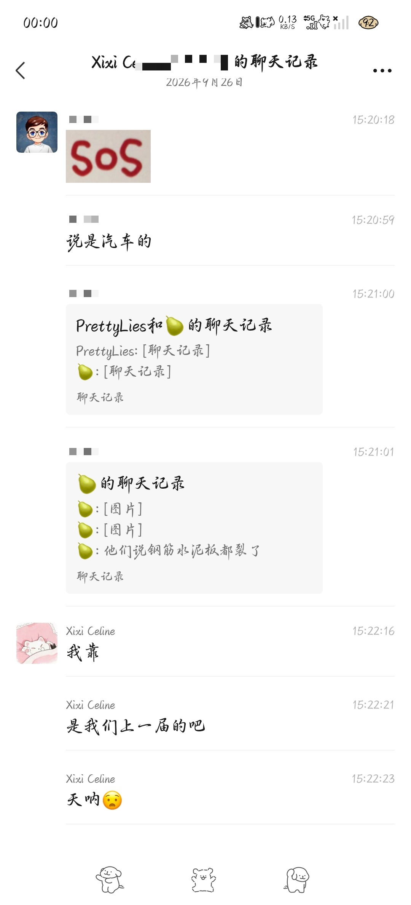
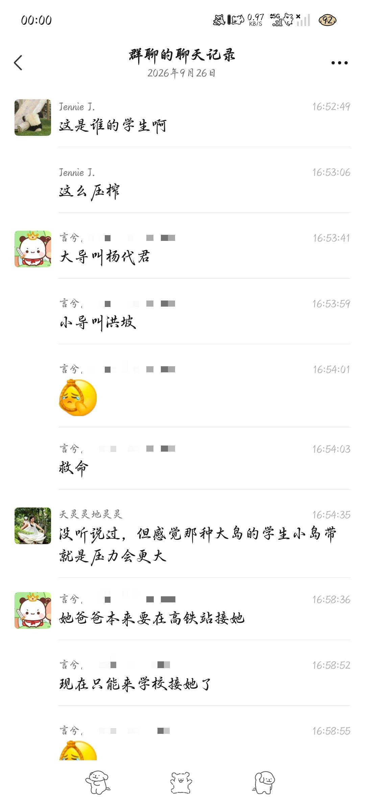
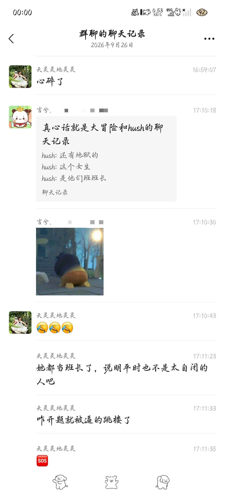
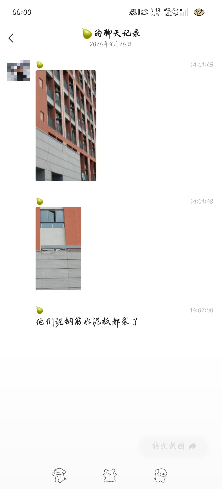

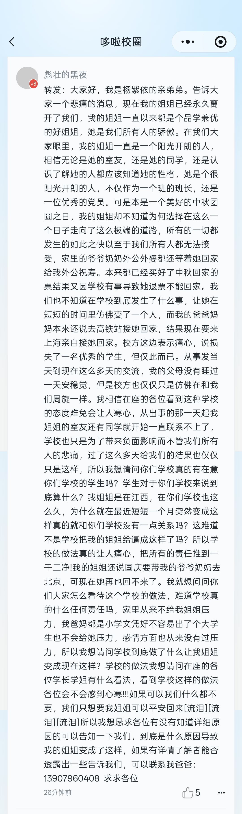

---
10.3补充：

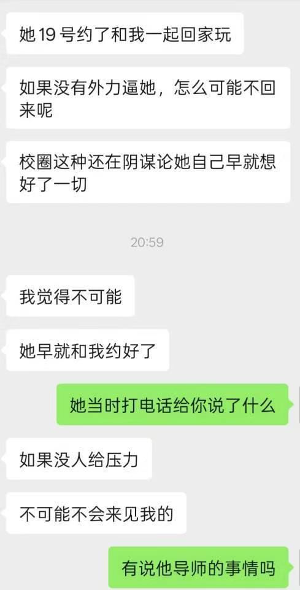
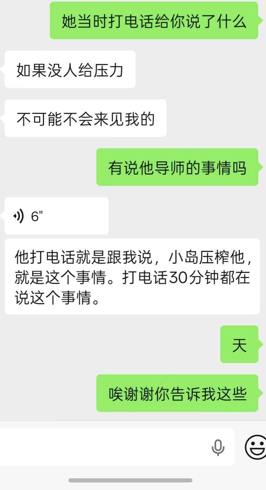
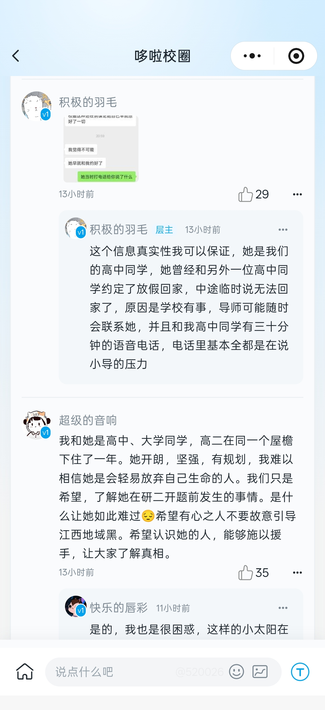
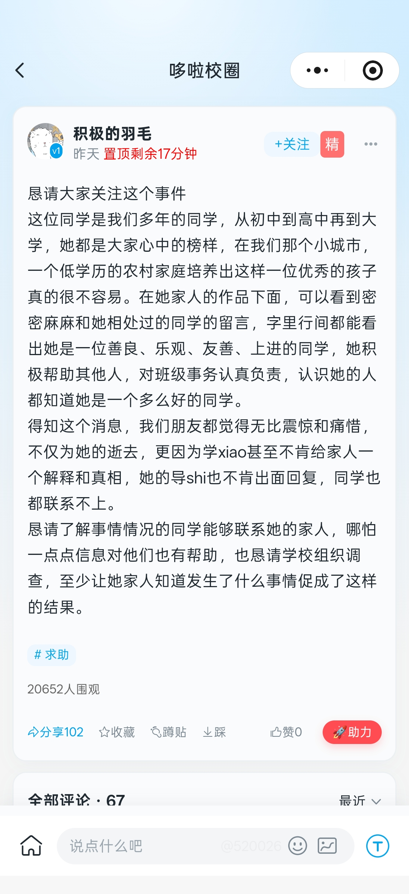
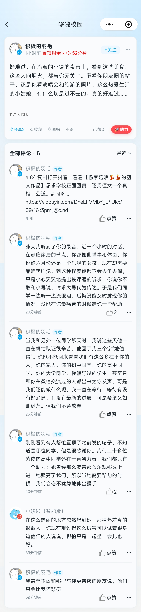
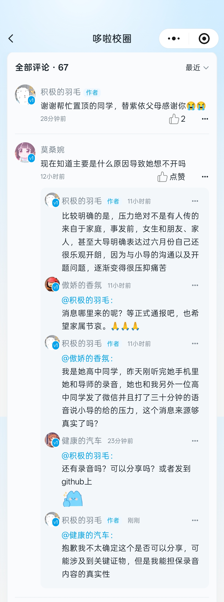

---

## 10.4 补充（10月4日整理）

> 本节整理 10 月 3–4 日流传的新材料：自称逝者高中同学的账号"积极的羽毛"在校园社区发布的信息同步帖（含所谓"录音节选"文本与谈判进展转述），以及网传文字与 AI 生成内容截图。**以下内容均为单方说法或 AI 生成内容，未经任何官方证实**，与第四节家属说法一样，仅作记录。

### 一、同学"信息同步"帖的说法（发帖者自称"以下内容均有可靠信源"，未证实）

1. **心理状况**：称紫依 9 月 23 日在医院确诊重度抑郁（有诊断书），自述"六月份还是一个乐观的小孩，现在却需要靠吃药睡觉"；
2. **归因**：称造成心理状况的原因"目前只能定位到来自小导的沟通、相处、选题压力"；称已排除家庭和情感原因（引多名高中同学、大学室友证言，称其家庭、人际关系融洽）；
3. **时间线补充**：9 月 19 日下午紫依与高中同学约定回家，并有近 30 分钟语音通话，发帖者称通话内容为倾诉小导压力；9 月 22 日被告知无法回家，理由是学校开题问题；
4. **关键材料**：称有"事发前紫依与大导关于更换选题的录音节选"（手机录音转文本），引述内容包括"最主要还是他给我的心理压力太大了""跟他沟通比较高ya（压）""他就一定要我按照他的规划来把这个课题做完"等（原文对"压力""抑郁"等敏感词多以拼音书写以规避审核，按"他"均指小导）；发帖者称能担保录音内容真实性，但因可能涉及关键证物未公开分享；
5. **学院方态度（发帖者称更新至 10 月 3 日第五次谈判，单方转述）**：
   - 五次谈判中，小导、同门师兄未曾出面，大导只参与过一次；
   - 学院方认为自身及导师对此事没有任何责任，表示目前证据无法证明导师责任；
   - 学院提出"出于人文关怀"补偿 10 万元，在最新谈判中提升至 20 万元；
   - 学院未提及对导师进行任何形式的处理。
6. **作者后续更新（10 月 4 日前后）**：
   - 家属已与学院进行五次谈判，谈判过程未让律师介入，学院态度较为强势；家属目前已寻求律师帮助，后续谈判律师会介入；
   - 家属和高中同学在多个平台发帖，目前均被下架，仅保留抖音作品但被限流；
   - 已对紫依手机、电脑设备信息进行存证；
   - 补充说明："大导提出给紫依买票回家"源自大导在谈判中的口头自述，没有任何书面证明；
7. **评论区情况**：有评论质疑上述证据"在司法程序上效力有限"、建议家属聘请专业律师、尝试反映学术不端等红线问题，也有评论对补偿金额与家属诉求展开讨论——反映网络舆论本身存在分歧。

### 二、网传关于小导的描述（未经证实的传闻）

- 一段网传文字以第三者口吻描述小导"估计是个 npd（自恋型人格障碍）"，列举其所谓的压学生行为（频繁开会、周末加班、阻拦学生实习等），文末称"杨同学估计也是这样的遭遇"。**该内容为个人主观判断与传闻转述，无任何证据支持，不应作为事实引用**。

### 三、AI 生成内容截图（提示）

- 截图下半部分为 AI 生成的事件摘要。此类 AI 摘要可能存在偏差，阅读时请以原始材料及官方结论为准。


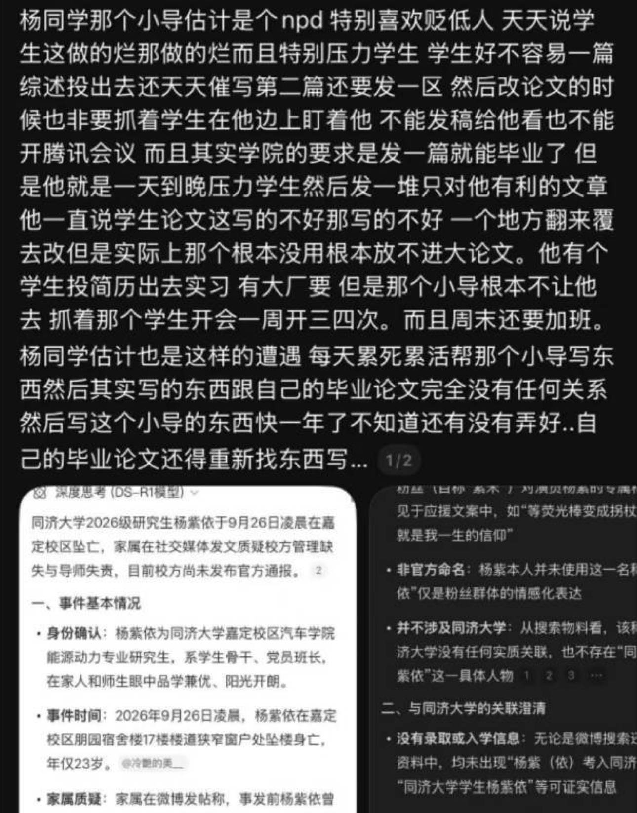

